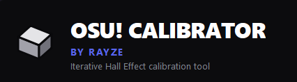

  

# Osu! Calibrator by Rayze

Welcome to the official repository for the **Osu! Calibrator**, a smart desktop tool designed specifically for osu! players using Hall Effect keyboards (Wooting, SayoDevice, DrunkDeer, ATK, etc.). 

Most of us blindly copy the Rapid Trigger and Actuation settings of top players. But if your settings clash with how *your* fingers naturally move, your keyboard gets confused. You end up dropping slider ends, double-tapping, or finger-locking—and it’s usually a hardware config issue, not a skill issue. 

This app mathematically analyzes your exact finger movements, calculates your Unstable Rate (UR), and acts as a digital coach to tell you **exactly how many millimeters to adjust your settings** to fix your misfires.

## How to Download (For Regular Users)

You do **not** need to download this source code unless you are a developer. 

1. Go to the **[Releases](../../releases)** tab on the right side of this page.
2. Download the latest `Osu! Calibrator.exe` file.
3. Run the `.exe`! 
*(Note: Windows SmartScreen might pop up since this is an indie app. Just click "More Info" -> "Run anyway").*

---

## Quick Start Guide

**Step 1: Plug in your Current Setup**
1. Look at your keyboard's software and type your current **Base Actuation**, **Rapid Trigger Press**, and **Rapid Trigger Release** into the app. *(If your keyboard only has one Rapid Trigger slider, uncheck the "Separate Sensitivity" box).*
2. Click **Record Keys** and tap your two main osu! stream keys to bind them.
3. Select a calibration track from the dropdown (or import your own MP3 stream maps).

**Step 2: Warm Up & Test**
* **🧘 Zen Mode (Optional):** Toggle the Zen Warm-up button to track your live UR over a rolling 30-second window. Warm up your hands before a real test without polluting your calibration data.
* **The 3-Phase Test:** Press the **Spacebar** to start the calibration. The app will run you through three short phases:
  * **Phase 1: Comfort Phase (8s) -** Tap along to the music at your natural, comfortable stream speed. *(Note: If this phase is incredibly messy, the "Mercy Rule" will pause the test and let you stop early to fix your settings).*
  * **Phase 2: Push Phase (6s) -** The metronome will dim. *Ignore the beat.* Tap as fast as you physically can without completely breaking form. We are looking for what happens when you fatigue.
  * **Phase 3: Stability Phase (8s) -** The metronome comes back. Return to your comfortable stream speed and try to lock back into the rhythm. 

**Step 3: Review Your Coaching Advice**
Once finished, the app will process the data and generate a custom report. Look at the **Calibration Advice** and the **Rapid Trigger** cards to see exactly how you should adjust your keyboard software.

---

## Understanding Your Results

The app doesn't just spit out numbers; it explains what happened. Here is what to look out for:

* **Tap Steadiness (UR):** An estimate of your Unstable Rate based on the consistency of your taps. Lower is better.
* **Mechanical Quality:** How "clean" your run was. If the app detects you mashing, dropping inputs, or bottoming out too hard, this score drops.
* **What Changed? (Transparency Log):** The app remembers your last run! When you change your settings and test again, this section will tell you in plain English *why* your advice changed (e.g., *"Your UR worsened by 12 points and we detected 4 new release noises."*).
* **Mechanics Tip:** Real, actionable advice. If the app notices you are hovering too close to the keys or tensing up, it will give you a physical technique tip to practice.

---

## FAQ

**Q: Why does the app say my tapping is "Volatile" and keep changing its advice?**
**A:** The app's math is highly sensitive. If you do three tests in a row, but your hands are cold or you keep changing your physical tapping style, the app has to change its recommendations to try and catch your new finger movements. Use **Zen Mode** to warm up for 5 minutes before calibrating so your hands are consistent!

**Q: Why did I get a warning that my Rapid Trigger values were "Recalculated"?**
**A:** Think of your Base Actuation as the physical "room" Rapid Trigger has to work inside. If your RT Press and RT Release numbers add up to be bigger than your Base Actuation, Rapid Trigger literally runs out of space to reset the key. The engine automatically detects this and mathematically caps your RT distances to a safe `70%` of your Base Actuation to prevent your keyboard from choking.

**Q: Why did the app change my Release distance to match my Press distance?**
**A:** If your keyboard feels muddy or you drop slider ends, your RT Release is likely set higher than your RT Press. This forces your finger to lift further to reset the key than it pushed to fire it. The app's "Anti-Sticky Override" automatically detects this physical constraint and caps the Release distance so it never exceeds the Press distance, guaranteeing snappy key resets.

**Q: Why did it tell me I've hit the "Depth Ceiling"?**
**A:** The app will never trap you in an infinite loop of going deeper. If it detects you've hit a safe hardware depth (`1.20mm`), it knows the keyboard is no longer the problem. It will refuse to recommend deeper settings and will pivot to coaching your finger technique instead.

**Q: What does it mean if it says "One finger is lagging behind"?**
**A:** This is called "Gallop Bias." It means instead of a perfectly even *1-2-1-2* rhythm, you are tapping like a galloping horse. The app will actually tell you which specific key is lagging. Try tilting your keyboard 10-20 degrees or adjusting your wrist posture to balance the travel distance.

**Q: Can I add my own beatmaps to practice to?**
**A:** Yes! Click **Import MP3** and select any audio file. The app will automatically try to read the BPM from the filename (e.g., `Blue Zenith [200 BPM].mp3`). If it can't find it, it will ask you to type the BPM in so the visual metronome can sync up perfectly.

**Q: Does this work if I don't have a Hall Effect (Rapid Trigger) keyboard?**
**A:** Technically, yes! You can still use the app to track your Unstable Rate, practice your streaming to the metronome, and read the "Mechanics Tip" card to improve your finger technique. However, you obviously won't be able to change the physical millimeter settings on a standard mechanical keyboard.

---

## License
This project is open source and licensed under the GNU General Public License v3.0 (GPLv3).
